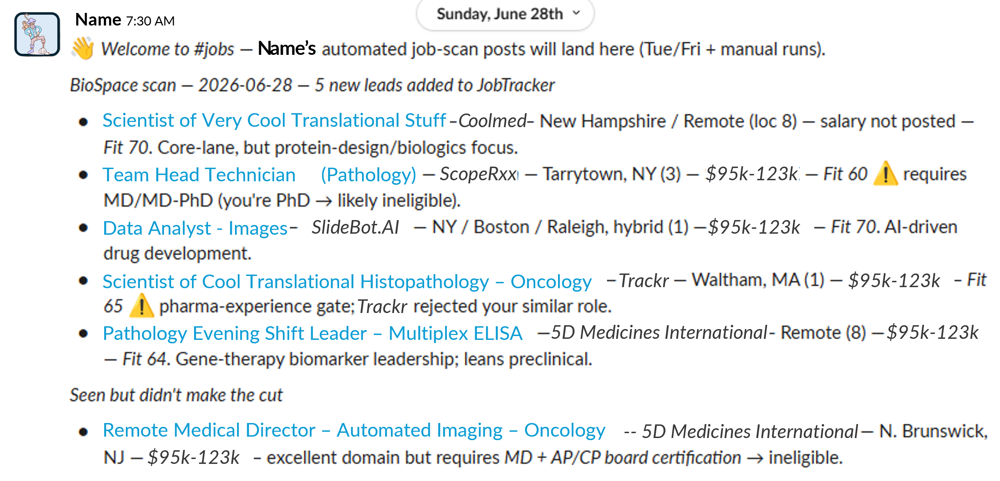
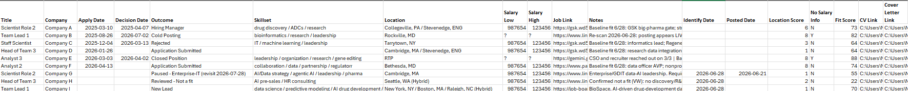
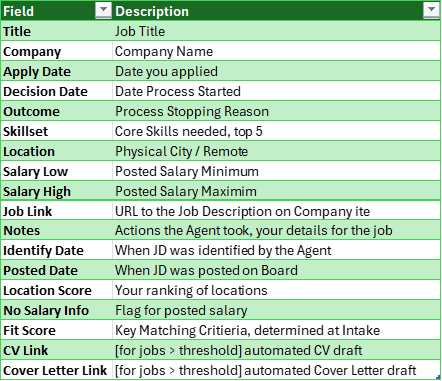

**Personal Recruiter**

A personalized, autonomous job-search scanning system built as Claude skills.

| | |
|---|---|
| **Quick setup** | [SETUP_GUIDE.md](SETUP_GUIDE.md) — step-by-step install and first run |
| **Full documentation** | [MANUAL.md](MANUAL.md) — architecture, storage backends, persona tuning, advanced usage |

## What is Personal Recruiter (job-scan-toolkit)?

job-scan-toolkit automates your job search by continuously scanning job boards for roles that match your unique profile, goals, and preferences. Instead of manually hunting through job listings, you define your target once, and the system does recurring scans, filters candidates intelligently against your personal rubric, and surfaces only the roles worth your time.

It's built as a set of three Claude skills that work together: one for setup, one for recurring scans, and one for tuning your preferences as your search evolves.

## Core Features

* **Personalized scanning** — Define your target seniority, problem domain, location scope, and disqualifiers once. The system remembers and uses them.
* **Multi-board coverage** — Scans your chosen job boards (LinkedIn, Indeed, AngelList, Blind, etc.) in a single run.
* **Intelligent filtering** — Scores each posting against your personal rubric and your stated goals, not just keyword matching.
* **Deduplication** — Tracks what you've already seen and skips repeats across scan runs.
* **Tailored documents** — Optionally auto-drafts CV and cover letter variants for standout matches based on each role.
* **Flexible storage** — Works with Notion, Jira+Confluence, GitHub, Google Drive, or local files for your job tracker.
* **On-demand calibration** — Refine your preferences mid-search through guided conversations grounded in real tracker data, not hand-editing.

## Core Outputs

Each scan run produces:

* **Summary briefing** — High-level report of what was scanned, how many new qualified leads were found, and highlights of standout matches. Posted to Slack on your schedule:

  
* **Updated job tracker** — New leads appended, stale postings marked dead, your running record stays current.
* **Optional application drafts** — For top-fit roles, ready-to-edit CV and cover letter tailored to that position.
* **Engagement log** — Records which roles you've actioned, skipped, or marked as interested for future reference.

## Sample tracker output

[**ExampleJobTracker.csv**](assets/ExampleJobTracker.csv) — a real tracker as pushed on each scheduled run.

What each field means

## Workflow Logic

<strong>1.1 · Setup (one-time)</strong> — run <code>job-scan-setup</code>

You'll be guided through:
- Your CVs/resumes and cover letters (a local folder/file path, or a cloud location if you have a connector for it) — mined for your trajectory, skills, and actual voice, including old versions
- Your history of past applications, including rejections — a URL if you have one, or just title + company if you don't; both count
- Your target job titles and seniority level
- The problems or domains you want to solve
- Disqualifiers (roles or companies you want to avoid), built partly from what your past applications reveal
- Which job boards to scan
- Location preferences
- Where to store your tracker (Notion, GitHub, Google Drive, etc.)
- Calibration thresholds and scoring weights

The skill creates your persona file, initializes your job tracker (backfilled from your past applications so the first scan doesn't re-surface anything), and schedules the recurring scan task.

<strong>1.2 · Recurring scans (automated or on-demand)</strong> — run <code>job-scan</code>

Run on a cadence (weekly, bi-weekly, or ad-hoc). Each run:
- Reads your persona to understand what you're looking for
- Sweeps the tracker for postings that have gone stale (removed from boards, past deadline)
- Scans your configured job boards for new listings
- Scores each posting against your rubric
- Dedupes against your tracker (skips roles you've already seen)
- Appends qualified new leads to your tracker
- Optionally drafts tailored application documents for top matches
- Delivers a summary of what was found

<strong>1.3 · Calibration (as needed)</strong> — run <code>persona-review</code>

Refine your preferences anytime. Instead of hand-editing your persona file or waiting for mid-run corrections, you get a guided conversation grounded in real evidence from your tracker. Update your target seniority, problems of interest, disqualifiers, scoring weights, or which boards to scan.

## Status

* Storage backend abstraction (`PersonaStore` / `JobStore`) is designed and wired into both `job-scan-setup` and `job-scan`.
* Persona-review skill is built and integrated into the setup and scan workflows.
* All three skills are production-ready.
